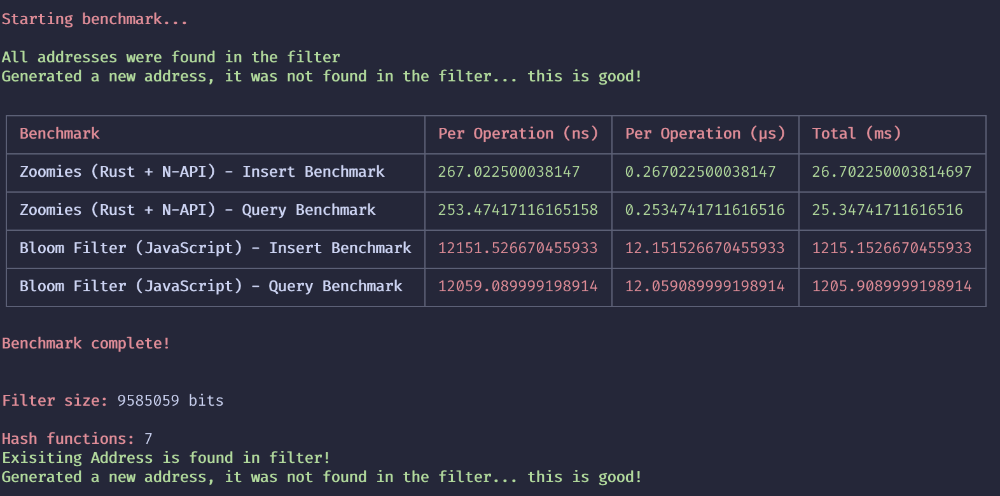

# zoomies-rs

Blazingly fast bloom filter implementation written in Rust + N-API bindings.

Querying the filter takes ~0.25µs whilst inserting taked ~0.26µs. This is ~45x faster than the [bloom-filter](https://www.npmjs.com/package/bloom-filter) package.

## Installation

```sh
npm install @kodeythomas/zoomies-rs
```

## Usage

```js
const { Zoomies } = require('@kodeythomas/zoomies-rs');

const filter = new Zoomies(1000, 0.01);

filter.insertAddress('0x01');
filter.insertAddress('0x02');

filter.queryAddress('0x01'); // true
filter.queryAddress('0x02'); // true

filter.queryAddress('0x03'); // false
```

## Benchmarks


